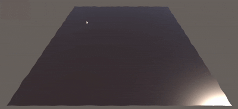
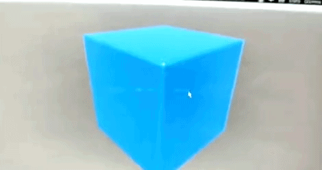

# Unity Heightfield Water Simulation

An implementation of a water surface simulation in Unity using heightfield-based techniques. This project demonstrates real-time wave propagation and fluid dynamics using GPU-accelerated heightmaps.

## Overview

This repository contains my work on developing a heightfield-based water simulation system for Unity. The implementation uses efficient computational techniques to simulate realistic water surface behavior, including wave propagation, dampening, and interaction with external forces.

## Key Features

- **Heightfield-Based Physics** — Efficient wave simulation using 2D heightmaps
- **GPU Acceleration** — Compute shaders for real-time performance
- **Interactive Ripples** — Supports dynamic disturbances to the water surface
- **Configurable Parameters** — Adjustable wave speed, damping, and simulation step size

## Visual Examples

### Water Plane

### Water Cube

## How It Works

The simulation uses a heightfield representation of the water surface, where each point stores the vertical displacement from a base level. The physics are computed using a wave equation solver that:

1. Calculates wave propagation across the heightfield
2. Applies damping to dissipate energy over time
3. Responds to external forces (collisions, user input, etc.)
4. Renders the result as a dynamic mesh or shader effect

## Note: Improved Version Available

The code in this repository is outdated. While it contains the foundational heightfield simulation work, the implementation has been significantly improved and refined in the main group project.

For the **most up-to-date and stable water simulation scripts**, see:

🔗 **[COMP2281/software-engineering-group25-26-12](https://github.com/COMP2281/software-engineering-group25-26-12)**

The improved implementation includes:
- **Better numerical stability** and performance optimizations
- **Enhanced stable fluid dynamics** (2D divergence-free advection)
- **VR integration** for Meta Quest 2
- **Production-ready code** with thorough testing
- **Comprehensive documentation**

### Updated Components

Key improved scripts from the group project:
- [`WaterHeightmap.cs`](https://github.com/COMP2281/software-engineering-group25-26-12/blob/main/Package/Runtime/Scripts/WaterHeightmap.cs) — My refined heightfield simulation with better stability and performance
- [`WaterCube.cs`](https://github.com/COMP2281/software-engineering-group25-26-12/blob/main/Package/Runtime/Scripts/WaterCube.cs) — An experimental 3D cube implementation

## Part of a Larger Project

This heightfield water simulation work formed the foundation for the **VR Taichi** project, which builds on these concepts with:
- Interactive paintball throwing with ripple generation
- Real-time colour diffusion and particle effects
- Multi-controller support for VR platforms
- Full Meta Quest 2 integration

## Technology Stack

- **C#** (primary language)
- **Unity** (2022.3.x)
- **GPU Compute Shaders** for heightfield simulation
- **Wolfram Language** (analysis and validation)

## Getting Started

This repository contains the original implementation. For a complete, production-ready VR application using refined water simulation, see the [group project repository](https://github.com/COMP2281/software-engineering-group25-26-12).

---

**Project Type:** University Software Engineering Group Project  
**My Role:** Heightfield Water Simulation Implementation  
**Status:** Superseded by improved implementation in main group project
